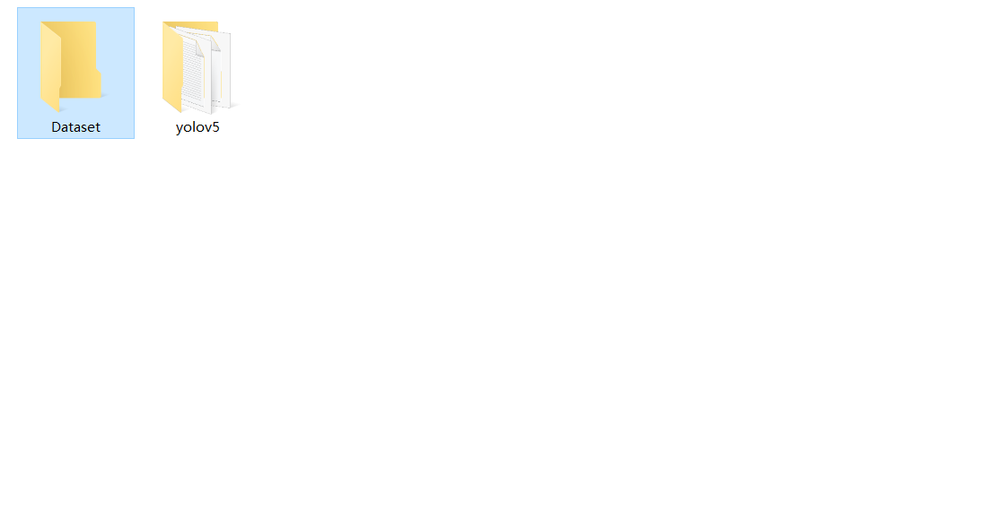
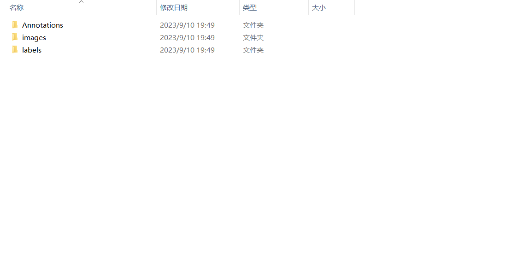

# yolov5
使用Pytorch框架和yolov5模型进行深度学习，并在Linux和Windows环境进行预测
## 项目简介

- 基于**pytorch**框架进行训练
- 基于**Tensorrt**加速**Yolov5 7.0**
- 支持**Windows10**和**Linux**
- 支持**Python/C++**

## 环境说明
### **Windows10**
- Tensorrt 8.2.5.1
- Cuda 10.2 Cudnn 8.2.1(**特别注意需安装两个cuda10.2补丁**)
- Opencv 3.4.6
- Cmake 3.17.1
- pytorch 1.10.0+cuda102
- VS 2017
- RTX3050

### **Linux(Jetson Nano)**
- Tensorrt 8.2.1.1
- Cuda 10.2 Cudnn 8.2.1
- Opencv 3.4.6
- Cmake 3.10.2

**以上是用于搭建TensorRT所需要的环境，使用yolov5训练可以安装最新的pytorch及其对应的CUDA**
#### 查看自己的版本
- Cuda      ```nvcc -V```
- Cudnn     查找查看cudnn_version.h文件
- TensorRT(Linux)  ```dpkg -l | grep TensorRT```
- Cmake     ```cmake --version```
- OpenCV(Linux C++)    ```pkg-config --modversion opencv```

## 运行案例(Windows)
创建一个新文件夹yolov5train作为自己的工作环境
从[yolov5 release v7.0](https://github.com/ultralytics/yolov5/releases/tag/v7.0)的Asset下载.pt模型，这里以yolov5m.pt为例。在yolov5train文件夹里下载yolov5 7.0源代码和本仓库代码
```
git clone -b v7.0 https://github.com/ultralytics/yolov5.git
git clone https://github.com/Monday-Leo/Yolov5_Tensorrt_Win10
```
也可以到 https://github.com/ultralytics/yolov5/tree/v7.0 下载zip

### 制作数据集
创建一个Dataset文件夹，用于存放数据集
<div align="center">

</div>
在Dataset里创建Annotations，images，labels文件夹

- Annotations 用于存放包含标框信息的xml文件，因为有些标框的软件只能生成xml，而yolo训练需要的是txt类型文件
- images 用于存放准备训练的图像
- labels 用于存放含标框信息的txt文件，可以使用本仓库的**create_txt.py**将xml转换成yolo需要的txt文件

<div align="center">

</div>

对数据集进行划分，这里以4：1划分成训练集(training)和验证集(validation)，当然也可以根据需求添加测试集(test)。可以使用本仓库的move.py文件将数据集划分。需要在yolov5train下新建tra和val文件夹，并在里面新建images和labels文件，之后修改move.py内的路径信息后运行即可。

### 开始训练
训练的主程序在main.py里,在训练之前，要修改一些文件和一些准备工作以适用于我们的数据集

- 本仓库的custom.yaml文件，包含了数据集路径和训练物体的名称信息。修改路径和名称
- 本仓库的my_yolov5m.yaml文件,是对yolov5/models/yolov5m.yaml的修改，包含了锚框大小和网络信息。可以在yolov5/utils/autoanchor.py的最后添加如下代码，img_size是对应main.py里train_command中--img-size，是训练时传入图片大小，与原图像无关。
  ```
  if __name__ =='__main__':
    a=kmean_anchors(dataset='E:/yolov5train/custom.yaml',n=9,img_size=640)
    '''
    dataset: 包含数据集路径的yaml文件
    n: 锚框的数量，一般yolov5n/s/m/l/x是9，yolov5n6/s6/m6/l6/x6是12
    img_size: 传入图片的大小，和训练时的图片大小一致，和原图像大小无关
    '''
    print(a)
  ```
  之后运行来获得最适合数据集的锚框大小，并在my_yolov5m.yaml里进行修改.**注意：这里获得的锚框的数据是小数，在custom.yaml里将anchor改成整数。**
#### 打开main.py

在train_command里，用于训练，修改--img-size(训练时传入图片大小，与原图像无关),--batch-size(单次传递用以训练的图像个数),--epochs(训练轮数)，--data为custom.yaml,--cfg为my_yolov5m.yaml，--weights为下载好的yolov5m.pt。

在eval_command里，用于测试，--weights为训练好的最佳权重，通常在yolov5/runs/train/exp/weights里。best.pt是训练时最佳的权重，last.pt是最后一轮训练后的权重。

修改完后运行main.py，要保证运行的python环境安装了pytorch和cuda。
