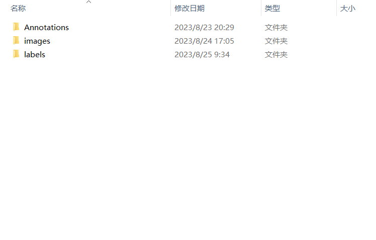

# yolov5
使用Pytorch框架和yolov5模型进行深度学习，并在Linux和Windows环境进行预测
## 项目简介

- 基于**pytorch**框架进行训练
- 基于**Tensorrt**加速**Yolov5 7.0**
- 支持**Windows10**和**Linux**
- 支持**Python/C++**

## 环境说明
### **Windows10**
- Tensorrt 8.2.5.1
- Cuda 10.2 Cudnn 8.2.1(**特别注意需安装两个cuda10.2补丁**)
- Opencv 3.4.6
- Cmake 3.17.1
- VS 2017
- RTX3050

### **Linux(Jetson Nano)**
- Tensorrt 8.2.1.1
- Cuda 10.2 Cudnn 8.2.1
- Opencv 3.4.6
- Cmake 3.10.2
#### 查看自己的版本
- Cuda      ```nvcc -V```
- Cudnn     查找查看cudnn_version.h文件
- TensorRT(Linux)  ```dpkg -l | grep TensorRT```
- Cmake     ```cmake --version```
- OpenCV(Linux C++)    ```pkg-config --modversion opencv```

## 运行案例(Windows)
创建一个新文件夹yolov5train作为自己的工作环境
从[yolov5 release v7.0](https://github.com/ultralytics/yolov5/releases/tag/v7.0)的Asset下载.pt模型，这里以yolov5m.pt为例。在yolov5train文件夹里下载yolov5 7.0源代码和本仓库代码
```
git clone -b v7.0 https://github.com/ultralytics/yolov5.git
git clone https://github.com/Monday-Leo/Yolov5_Tensorrt_Win10
```
也可以到 https://github.com/ultralytics/yolov5/tree/v7.0 下载zip
<div align="center">

</div>

### 制作数据集
创建一个Dataset文件夹，用于存放数据集
<div align="center">

</div>
在Dataset里创建Annotations，images，labels文件夹

- Annotations 用于存放包含标框信息的xml文件，因为有些标框的软件只能生成xml，而yolo训练需要的是txt类型文件
- images 用于存放准备训练的图像
- labels 用于存放含标框信息的txt文件，可以使用本仓库的**create_txt.py**将xml转换成yolo需要的txt文件

<div align="center">

</div>

对数据集进行划分，这里以4：1划分成训练集和验证集。可以使用本仓库的move.py文件将数据集划分。需要在yolov5train下新建tra和val文件夹，并在里面新建images和labels文件，之后修改move.py内的路径信息后运行即可。
